# Cross Aggregation Transformer for Image Restoration

[Zheng Chen](https://zhengchen1999.github.io/), [Yulun Zhang](http://yulunzhang.com/), [Jinjin Gu](https://www.jasongt.com/), [Yongbing Zhang](https://shinning0821.github.io/index.html), [Linghe Kong](https://www.cs.sjtu.edu.cn/~linghe.kong/), and [Xin Yuan](https://xygroup6.github.io/xygroup/), "Cross Aggregation Transformer for Image Restoration", NeurIPS, 2022 (Spotlight)

[[paper](https://openreview.net/pdf?id=wQ2QNNP8GtM)] [[arXiv](https://arxiv.org/abs/2211.13654)] [[supplementary material](https://openreview.net/attachment?id=wQ2QNNP8GtM&name=supplementary_material)] [[visual results](https://drive.google.com/drive/folders/1SIQ342yyrlHTCxINf9wYNchOa5eOw_7s?usp=sharing)] [[pretrained models](https://drive.google.com/drive/folders/1ebwl3ahPFczEswRNNIKYbO2PwZt0ZbqU?usp=sharing)]

---

> **Abstract:** *Recently, Transformer architecture has been introduced into image restoration to replace convolution neural network (CNN) with surprising results. Considering the high computational complexity of Transformer with global attention, some methods use the local square window to limit the scope of self-attention. However, these methods lack direct interaction among different windows, which limits the establishment of long-range dependencies. To address the above issue, we propose a new image restoration model, Cross Aggregation Transformer (CAT). The core of our CAT is the Rectangle-Window Self-Attention (Rwin-SA), which utilizes horizontal and vertical rectangle window attention in different heads parallelly to expand the attention area and aggregate the features cross different windows. We also introduce the Axial-Shift operation for different window interactions. Furthermore, we propose the Locality Complementary Module to complement the self-attention mechanism, which incorporates the inductive bias of CNN (e.g., translation invariance and locality) into Transformer, enabling global-local coupling. Extensive experiments demonstrate that our CAT outperforms recent state-of-the-art methods on several image restoration applications.* 
>
> <p align="center">
> 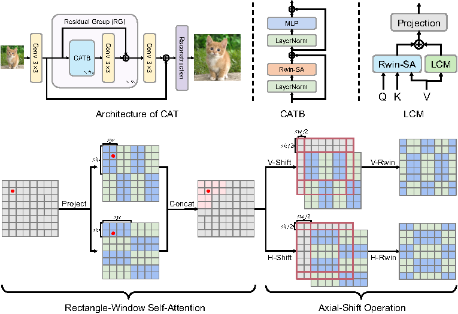
> </p>

---

|                       SR (x4)                        |                      HQ                       |                         LQ                         | [SwinIR](https://github.com/JingyunLiang/SwinIR)  |                   CAT (ours)                   |
| :--------------------------------------------------: | :-------------------------------------------: | :------------------------------------------------: | :-----------------------------------------------: | :--------------------------------------------: |
| 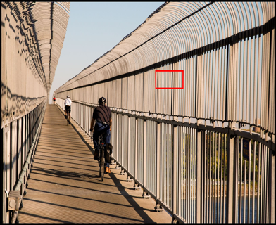 |  | 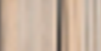 | 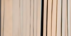 | 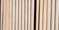 |
| 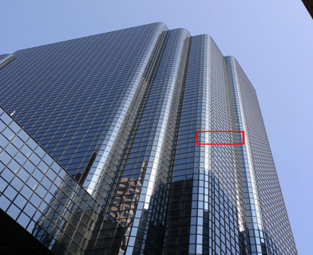 |  | 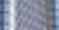 |  |  |

## Dependencies

- Python 3.8
- PyTorch 1.8.0
- NVIDIA GPU + [CUDA](https://developer.nvidia.com/cuda-downloads)

```bash
# Clone the github repo and go to the default directory 'CAT'.
git clone https://github.com/zhengchen1999/CAT.git
conda create -n CAT python=3.8
conda activate CAT
pip install -r requirements.txt
python setup.py develop
```

## TODO

* [x] Image SR
* [x] JPEG Compression Artifact Reduction
* [x] Image Denoising
* [ ] Other tasks

## Contents

1. [Datasets](#Datasets)
1. [Models](#Models)
1. [Training](#Training)
1. [Testing](#Testing)
1. [Results](#Results)
1. [Citation](#Citation)
1. [Acknowledgements](#Acknowledgements)

---

## Datasets


Used training and testing sets can be downloaded as follows:

| Task                                          |                         Training Set                         |                         Testing Set                          |                        Visual Results                        |
| :-------------------------------------------- | :----------------------------------------------------------: | :----------------------------------------------------------: | :----------------------------------------------------------: |
| image SR                                      | [DIV2K](https://data.vision.ee.ethz.ch/cvl/DIV2K/) (800 training images) +  [Flickr2K](https://cv.snu.ac.kr/research/EDSR/Flickr2K.tar) (2650 images) [complete training dataset [DF2K](https://drive.google.com/file/d/1TubDkirxl4qAWelfOnpwaSKoj3KLAIG4/view?usp=share_link)] | Set5 + Set14 + BSD100 + Urban100 + Manga109 [complete testing dataset [download](https://drive.google.com/file/d/1yMbItvFKVaCT93yPWmlP3883XtJ-wSee/view?usp=sharing)] | [here](https://drive.google.com/drive/folders/122LBzNSuc-YwzyTzA2VL9mXSJPWBxICZ?usp=sharing) |
| grayscale JPEG compression artifact reduction | [DIV2K](https://data.vision.ee.ethz.ch/cvl/DIV2K/) (800 training images) +  [Flickr2K](https://cv.snu.ac.kr/research/EDSR/Flickr2K.tar) (2650 images) + [WED](http://ivc.uwaterloo.ca/database/WaterlooExploration/exploration_database_and_code.rar)(4744 images) + [BSD500](http://www.eecs.berkeley.edu/Research/Projects/CS/vision/grouping/BSR/BSR_bsds500.tgz) (400 training&testing images) [complete training dataset [DFWB](https://drive.google.com/file/d/1IASyJRsX9CKBE0i5iSJMelIr_a6U5Qcd/view?usp=share_link)] | Classic5 +LIVE + Urban100 [complete testing dataset [download](https://drive.google.com/file/d/17hwSblurN93ndKFRFQQdoRgB-6pFmGtd/view?usp=sharing)] | [here](https://drive.google.com/drive/folders/1xwBMPRUIAnpjAynEr9GI8Wenl6D-J8i3?usp=sharing) |
| real image denoising                          | [SIDD](https://www.eecs.yorku.ca/~kamel/sidd/) (320 training images) [complete training dataset [SIDD](https://drive.google.com/drive/folders/1L_8ig1P71ikzf8PHGs60V6dZ2xoCixaC?usp=share_link)] | [SIDD](https://drive.google.com/file/d/11vfqV-lqousZTuAit1Qkqghiv_taY0KZ/view?usp=sharing) + [DND](https://drive.google.com/file/d/1CYCDhaVxYYcXhSfEVDUwkvJDtGxeQ10G/view?usp=sharing) [complete testing dataset [download](https://drive.google.com/file/d/1Vuu0uhm_-PAG-5UPI0bPIaEjSfrSvsTO/view?usp=share_link)] | [here](https://drive.google.com/drive/folders/14chIIFh6uG4M-aOyJcu6mYjDIpm4zE5t?usp=sharing) |

Here the visual results are generated under SR (x4), JPEG compression artifact reduction (q10), and real image denoising.

Download training and testing datasets and put them into the corresponding folders of `datasets/` and `restormer/datasets`. See [datasets](datasets/README.md) for the detail of directory structure.

## Models

|  Task   | Method  | Params (M) | FLOPs (G) | Dataset  | PSNR (dB) |  SSIM  |                          Model Zoo                           |                        Visual Results                        |
| :-----: | :------ | :--------: | :-------: | :------: | :-------: | :----: | :----------------------------------------------------------: | :----------------------------------------------------------: |
|   SR    | CAT-R   |   16.60    |   292.7   | Urban100 |   27.45   | 0.8254 | [Google Drive](https://drive.google.com/drive/folders/1xAFaLnUyloWxK-aXwGzF3rYK0kVh87G5?usp=sharing) | [Google Drive](https://drive.google.com/file/d/1_8ybr6WWvX5YXc7aluq31ZE12mpQ5upl/view?usp=share_link) |
|   SR    | CAT-A   |   16.60    |   360.7   | Urban100 |   27.89   | 0.8339 | [Google Drive](https://drive.google.com/drive/folders/1Xm4xQXI74gZcPwgmQHw1qbgdEA0kVCSP?usp=sharing) | [Google Drive](https://drive.google.com/file/d/1vO04maPnzPMJ7y8B8u3-fZsbGQYR6-Hn/view?usp=share_link) |
|   SR    | CAT-R-2 |   11.93    |   216.3   | Urban100 |   27.59   | 0.8285 | [Google Drive](https://drive.google.com/drive/folders/175wdTqjpURS7TSRIj3DODVI_ppktqdJu?usp=sharing) | [Google Drive](https://drive.google.com/file/d/1jSZMdlOrHaiaCLEqP_xAy6hPKhM-McX4/view?usp=share_link) |
|   SR    | CAT-A-2 |   16.60    |   387.9   | Urban100 |   27.99   | 0.8357 | [Google Drive](https://drive.google.com/drive/folders/1oBCa_ZmKQnqtkgfk2b5P5nGi-c2oH6Ez?usp=sharing) | [Google Drive](https://drive.google.com/file/d/1v9crwaWY50eYt2m7tnmEyfUQXFm5T7sc/view?usp=share_link) |
|   CAR   | CAT     |   16.20    |   346.4   |  LIVE1   |   29.89   | 0.8295 | [Google Drive](https://drive.google.com/drive/folders/18414_dEErUhZyeHfWGaSa6PLesM3X3ie?usp=sharing) | [Google Drive](https://drive.google.com/drive/folders/1xwBMPRUIAnpjAynEr9GI8Wenl6D-J8i3?usp=sharing) |
| real-DN | CAT     |   25.77    |   53.2    |   SIDD   |   40.01   | 0.9600 | [Google Drive](https://drive.google.com/drive/folders/1rkNeKeGiZqKit0M_AxFx1yfGu6z1ahgc?usp=sharing) | [Google Drive](https://drive.google.com/drive/folders/14chIIFh6uG4M-aOyJcu6mYjDIpm4zE5t?usp=sharing) |

The performance is reported on Urban100 (x4, SR), LIVE1 (q=10, CAR), and SIDD (real-DN). The test input size of FLOPs is 128 x 128.

## Training

### Image SR

- Cd to 'CAT' and run the setup script.

  ```shell
  # If already in CAT and set up, please ignore
  python setup.py develop
  ```

- Download [training](https://drive.google.com/file/d/1TubDkirxl4qAWelfOnpwaSKoj3KLAIG4/view?usp=share_link) (DF2K, already processed) and [testing](https://drive.google.com/file/d/1yMbItvFKVaCT93yPWmlP3883XtJ-wSee/view?usp=sharing) (Set5, Set14, BSD100, Urban100, Manga109, already processed) datasets, place them in `datasets/`.

- Run the following scripts. The training configuration is in `options/train/`.

  ```shell
  # CAT-R, SR, input=64x64, 4 GPUs
  python -m torch.distributed.launch --nproc_per_node=4 --master_port=4321 basicsr/train.py -opt options/train/train_CAT_R_sr_x2.yml --launcher pytorch
  python -m torch.distributed.launch --nproc_per_node=4 --master_port=4321 basicsr/train.py -opt options/train/train_CAT_R_sr_x3.yml --launcher pytorch
  python -m torch.distributed.launch --nproc_per_node=4 --master_port=4321 basicsr/train.py -opt options/train/train_CAT_R_sr_x4.yml --launcher pytorch
  
  # CAT-A, SR, input=64x64, 4 GPUs
  python -m torch.distributed.launch --nproc_per_node=4 --master_port=4321 basicsr/train.py -opt options/train/train_CAT_A_sr_x2.yml --launcher pytorch
  python -m torch.distributed.launch --nproc_per_node=4 --master_port=4321 basicsr/train.py -opt options/train/train_CAT_A_sr_x3.yml --launcher pytorch
  python -m torch.distributed.launch --nproc_per_node=4 --master_port=4321 basicsr/train.py -opt options/train/train_CAT_A_sr_x4.yml --launcher pytorch
  
  # CAT-R-2, SR, input=64x64, 4 GPUs
  python -m torch.distributed.launch --nproc_per_node=4 --master_port=4321 basicsr/train.py -opt options/train/train_CAT_R_2_sr_x2.yml --launcher pytorch
  python -m torch.distributed.launch --nproc_per_node=4 --master_port=4321 basicsr/train.py -opt options/train/train_CAT_R_2_sr_x3.yml --launcher pytorch
  python -m torch.distributed.launch --nproc_per_node=4 --master_port=4321 basicsr/train.py -opt options/train/train_CAT_R_2_sr_x4.yml --launcher pytorch
  
  # CAT-A-2, SR, input=64x64, 4 GPUs
  python -m torch.distributed.launch --nproc_per_node=4 --master_port=4321 basicsr/train.py -opt options/train/train_CAT_A_2_sr_x2.yml --launcher pytorch
  python -m torch.distributed.launch --nproc_per_node=4 --master_port=4321 basicsr/train.py -opt options/train/train_CAT_A_2_sr_x3.yml --launcher pytorch
  python -m torch.distributed.launch --nproc_per_node=4 --master_port=4321 basicsr/train.py -opt options/train/train_CAT_A_2_sr_x4.yml --launcher pytorch
  ```

- The training experiment is in `experiments/`.

### JPEG Compression Artifact Reduction

- Cd to 'CAT' and run the setup script

  ```shell
  # If already in CAT and set up, please ignore
  python setup.py develop
  ```

- Download [training](https://drive.google.com/file/d/1IASyJRsX9CKBE0i5iSJMelIr_a6U5Qcd/view?usp=share_link) (DFWB, already processed) and [testing](https://drive.google.com/file/d/17hwSblurN93ndKFRFQQdoRgB-6pFmGtd/view?usp=sharing) (Classic5, LIVE1, Urban100, already processed) datasets, place them in `datasets/`.

- Run the following scripts. The training configuration is in `options/train/`.

  ```shell
  # CAT, CAR, input=128x128, 4 GPUs
  python -m torch.distributed.launch --nproc_per_node=4 --master_port=4321 basicsr/train.py -opt options/train/train_CAT_car_q10.yml --launcher pytorch
  python -m torch.distributed.launch --nproc_per_node=4 --master_port=4321 basicsr/train.py -opt options/train/train_CAT_car_q20.yml --launcher pytorch
  python -m torch.distributed.launch --nproc_per_node=4 --master_port=4321 basicsr/train.py -opt options/train/train_CAT_car_q30.yml --launcher pytorch
  python -m torch.distributed.launch --nproc_per_node=4 --master_port=4321 basicsr/train.py -opt options/train/train_CAT_car_q40.yml --launcher pytorch
  ```

- The training experiment is in `experiments/`.

### Real Image Denoising

- Cd to 'CAT/restormer' and run the setup script

  ```shell
  # If already in restormer and set up, please ignore
  python setup.py develop --no_cuda_ext
  ```

- Download [training](https://drive.google.com/drive/folders/1L_8ig1P71ikzf8PHGs60V6dZ2xoCixaC?usp=share_link) (SIDD-train, contains validation dataset, already processed) datasets, and place them in `datasets/` (`restormer/datasets/`).

- Run the following scripts. The training configuration is in `options/` (`restormer/options/`).

  ```shell
  # CAT, Real DN, Progressive Learning, 8 GPUs
  python -m torch.distributed.launch --nproc_per_node=8 --master_port=4321 basicsr/train.py -opt options/train_RealDenoising_CAT.yml --launcher pytorch
  ```

- The training experiment is in `experiments/` (`restormer/experiments/`).

## Testing

### Image SR

- Cd to 'CAT' and run the setup script

  ```shell
  # If already in CAT and set up, please ignore
  python setup.py develop
  ```

- Download the pre-trained [models](https://drive.google.com/drive/folders/1Pd4tuE3f84aY5bcjR8KA5FshAT3-MXLB?usp=sharing) and place them in `experiments/pretrained_models/`.

  We provide pre-trained models for image SR: CAT-R, CAT-A, CAT-A, and CAT-R-2 (x2, x3, x4).

- Download [testing](https://drive.google.com/file/d/1yMbItvFKVaCT93yPWmlP3883XtJ-wSee/view?usp=sharing) (Set5, Set14, BSD100, Urban100, Manga109, already processed) datasets, place them in `datasets/`.

- Run the following scripts. The testing configuration is in `options/test/` (e.g., [test_CAT_R_sr_x2.yml](options/test/test_CAT_R_sr_x2.yml)).

  Note 1:  You can set `use_chop: True` (default: False) in YML to chop the image for testing.

  ```shell
  # No self-ensemble
  # CAT-R, SR, reproduces results in Table 2 of the main paper
  python basicsr/test.py -opt options/test/test_CAT_R_sr_x2.yml
  python basicsr/test.py -opt options/test/test_CAT_R_sr_x3.yml
  python basicsr/test.py -opt options/test/test_CAT_R_sr_x4.yml
  
  # CAT-A, SR, reproduces results in Table 2 of the main paper
  python basicsr/test.py -opt options/test/test_CAT_A_sr_x2.yml
  python basicsr/test.py -opt options/test/test_CAT_A_sr_x3.yml
  python basicsr/test.py -opt options/test/test_CAT_A_sr_x4.yml
  
  # CAT-R-2, SR, reproduces results in Table 1 of the supplementary material
  python basicsr/test.py -opt options/test/test_CAT_R_2_sr_x2.yml
  python basicsr/test.py -opt options/test/test_CAT_R_2_sr_x3.yml
  python basicsr/test.py -opt options/test/test_CAT_R_2_sr_x4.yml
  
  # CAT-A-2, SR, reproduces results in Table 1 of the supplementary material
  python basicsr/test.py -opt options/test/test_CAT_A_2_sr_x2.yml
  python basicsr/test.py -opt options/test/test_CAT_A_2_sr_x3.yml
  python basicsr/test.py -opt options/test/test_CAT_A_2_sr_x4.yml
  ```

- The output is in `results/`.

### JPEG Compression Artifact Reduction

- Cd to 'CAT' and run the setup script

  ```shell
  # If already in CAT and set up, please ignore
  python setup.py develop
  ```

- Download the pre-trained [models](https://drive.google.com/drive/folders/18414_dEErUhZyeHfWGaSa6PLesM3X3ie?usp=sharing) and place them in `experiments/pretrained_models/`.

  We provide pre-trained models for JPEG compression artifact reduction: CAT (q10, q20, q30, q40).

- Download [testing](https://drive.google.com/file/d/17hwSblurN93ndKFRFQQdoRgB-6pFmGtd/view?usp=sharing) (Classic5, LIVE, Urban100, already processed) datasets, place them in `datasets/`.

- Run the following scripts. The testing configuration is in `options/test/` (e.g., [test_CAT_car_q10.yml](options/test/test_CAT_car_q10.yml)).

  ```shell
  # No self-ensemble
  # CAT-A, CAR, rereproduces results in Table 3 of the main paper
  python basicsr/test.py -opt options/test/test_CAT_car_q10.yml
  python basicsr/test.py -opt options/test/test_CAT_car_q20.yml
  python basicsr/test.py -opt options/test/test_CAT_car_q30.yml
  python basicsr/test.py -opt options/test/test_CAT_car_q40.yml
  ```

- The output is in `results/`.

### Real Image Denoising

- Cd to 'CAT' and run the setup script

  ```shell
  # If already in CAT and set up, please ignore
  python setup.py develop
  ```

- Download the pre-trained [models](https://drive.google.com/drive/folders/1rkNeKeGiZqKit0M_AxFx1yfGu6z1ahgc?usp=sharing) and place them in `experiments/pretrained_models/`.

- Download [testing](https://drive.google.com/drive/folders/1EYrJjnFi2S91pI-QaSh85gemS02H-pV6?usp=sharing) (SIDD, DND) datasets, place them in `datasets/`.

- Run the following scripts. The testing configuration is in `options/test/`.

  ```shell
  # No self-ensemble
  # CAT, real DN, reproduces results in Table 4 of the main paper
  # testing on SIDD
  python test_real_denoising_sidd.py --save_images
  evaluate_sidd.m
  
  # testing on DND
  python test_real_denoising_dnd.py --save_images
  ```

- The output is in `results/`.

## Results

We achieved state-of-the-art performance on image SR, JPEG compression artifact reduction and real image denoising. Detailed results can be found in the paper. All visual results of CAT can be downloaded [here](https://drive.google.com/drive/folders/1SIQ342yyrlHTCxINf9wYNchOa5eOw_7s?usp=sharing).

<details>
<summary>Image SR (click to expan)</summary>


- results in Table 2 of the main paper

<p align="center">
  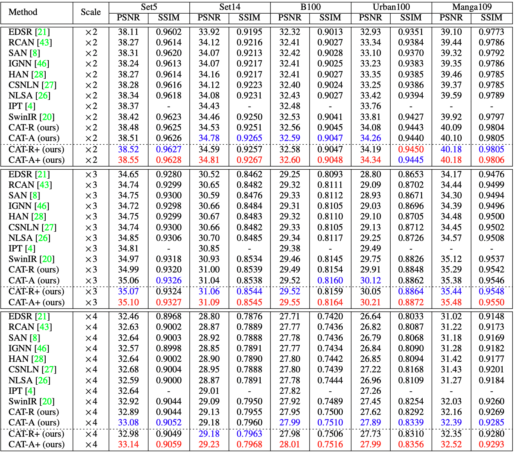
</p>


- results in Table 1 of the supplementary material

<p align="center">
  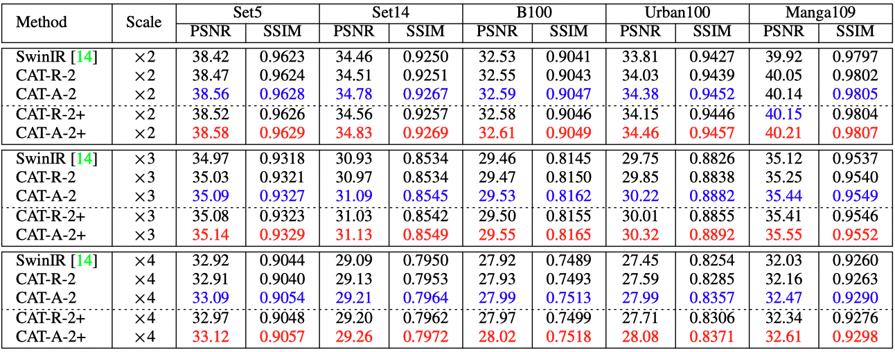
</p>

- visual comparison (x4) in the main paper

<p align="center">
  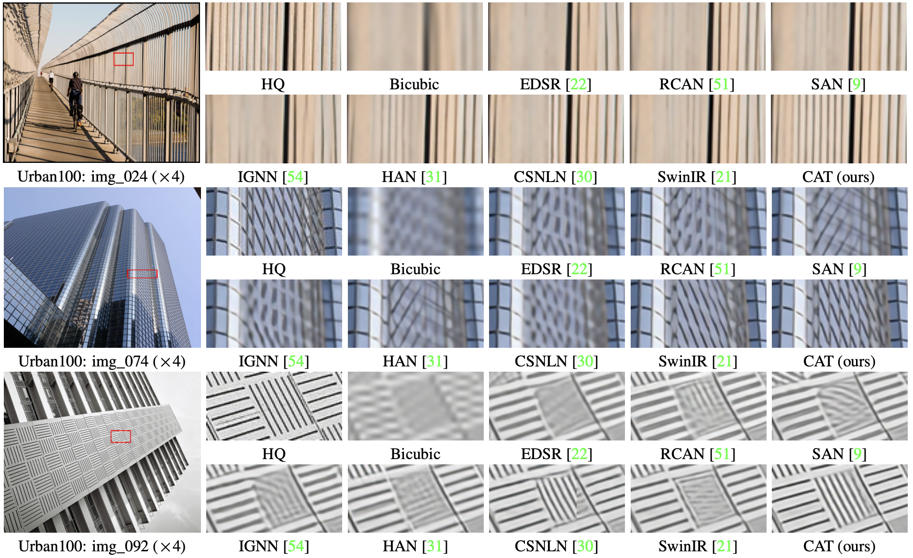
</p>

- visual comparison (x4) in the supplementary material

<p align="center">
  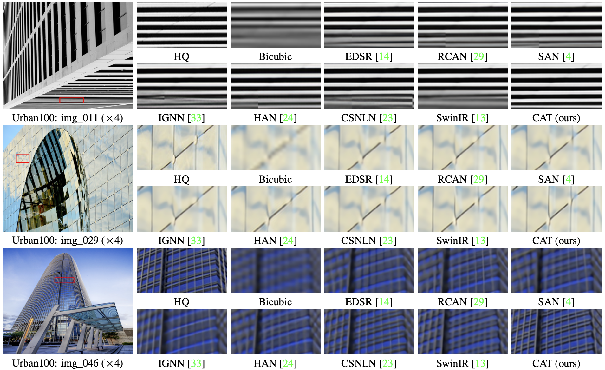
  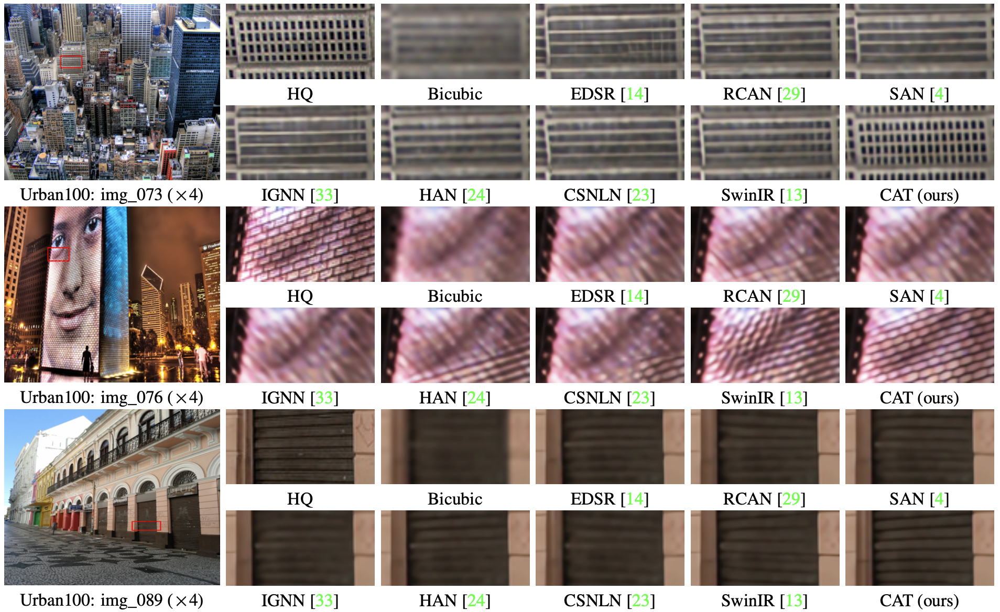
  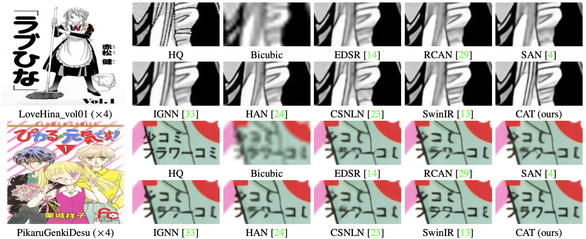
</p>

</details>

<details>
<summary>JPEG Compression Artifact Reduction (click to expan)</summary>


- results in Table 3 of the main paper

<p align="center">
  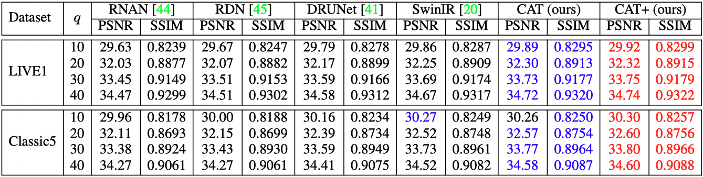
</p>


- results in Table 3 of the supplementary material (test on **Urban100**)

<p align="center">
  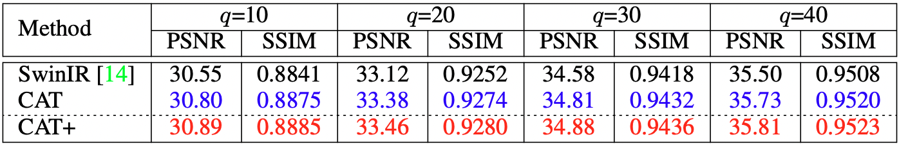
</p>

- visual comparison (q=10) in the main paper

<p align="center">
  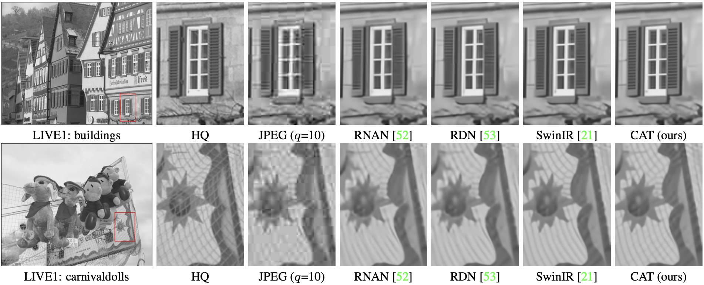
</p>

- visual comparison (q=10) in the supplementary material

<p align="center">
  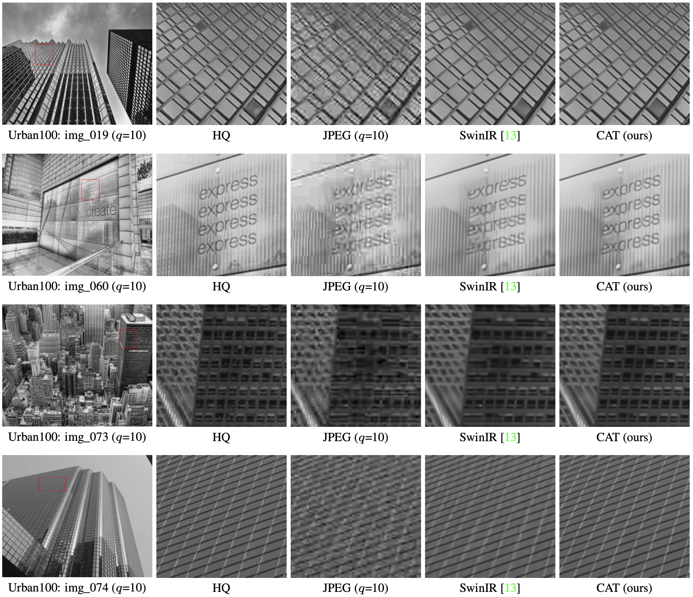
  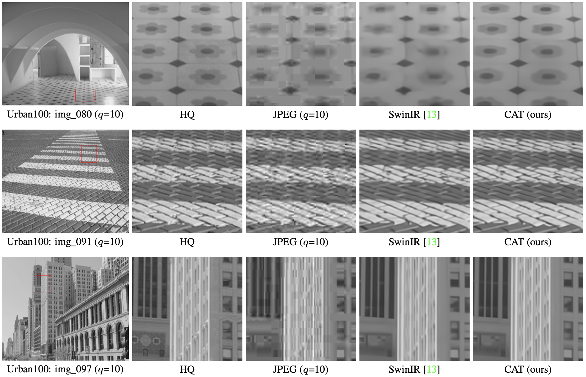
  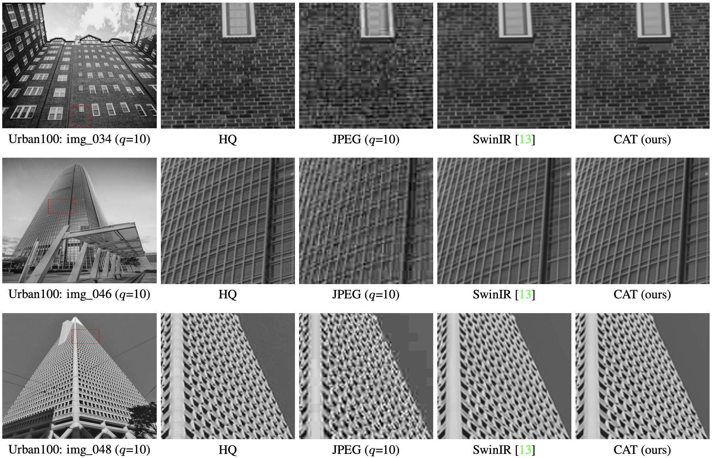
</p>

</details>

<details>
<summary>Real Image Denoising (click to expan)</summary>


- results in Table 4 of the main paper

<p align="center">
  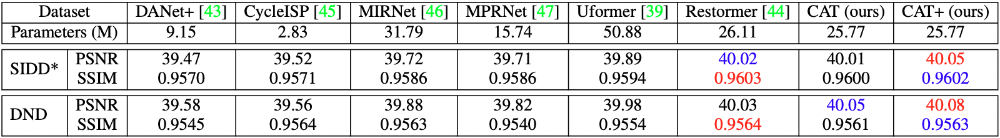
</p>

*: We re-test the SIDD with all official pre-trained models.

</details>

## Citation

If you find the code helpful in your resarch or work, please cite the following paper(s).

```
@inproceedings{chen2022cross,
    title={Cross Aggregation Transformer for Image Restoration},
    author={Chen, Zheng and Zhang, Yulun and Gu, Jinjin and Zhang, Yongbing and Kong, Linghe and Yuan, Xin},
    booktitle={NeurIPS},
    year={2022}
}
```

## Acknowledgements

This code is built on  [BasicSR](https://github.com/XPixelGroup/BasicSR) and [Restormer](https://github.com/swz30/Restormer).
